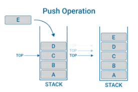
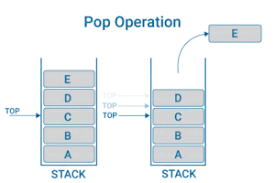
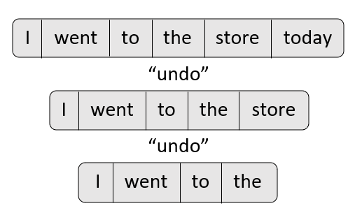

# **Stacks**
Stacks are a data structure where the items within are organized exactly the way it sounds: They are stacked. This means that the last value added to the stack will be on the top meaning it is the first to be drawn from the stack. Now, before we dive deaper into how stacks function we need to discuss how to measure the performance of stacks and other data structures.

## Big O notation
Big O notation is a way to measure the performance of your code. Because we are dealing with data structures, we will also discuss their performance and the effectiveness of the code that is written.

### O(n) 
We achieve O(n) performance when we have to iterate through every piece of data in a certain data structure. The n represents the amount of data. An example of this is:

```Python

for x in numbers:
    if x = 5
        return x
    else:
        return False
```
This is a basic O(n) operation that  needs to iterate through the list to find the specific value for x. It could find it after checking two numbers. It could find it after checking 28 numbers. O(n) basically means that there is no guarantee that it will find it faster than needing to iterate through the entire data structure or list. 

O(n) operations can add on to one another as well. If you have two for loops using the same list then it would be O(n) + O(n) = 2O(n) which in this case we write as O(2n). There are many ways to adjust the O(n) operations. You could also put a for loop within another for loop which would result in O(n^2) this is because it has to iterate through the entire list or structure of one for loop for a single value of the other for loop. This means you would multiply n by itself or n^2.

### O(1)
O(1) is the optimal speed at which a code can run. Some data structures are specifically designed so as to allow values to be found instantly rather than iterating through the entire structure.

Now that we know a little about big O operations we can move on to how stacks work.


## Push and Pop Operations
Within the data structure of stacks, there are push and pop operations. It is easier understand these operations when you visualize a stack of some sort. You could visualize a stack of bricks, a stack of pancakes, etc. If we look at a stack of pancakes we see that the last one to be put on the stack (meaning it is on top) is the first to be eaten. This is often called "Last In, First Out". Everytime we add something to the stack, this is called a **push** operation. There is a visual below to give you an idea of what this looks like.



Once something is pushed to the stack, the stack increases. At some point we are able to take a value off of the stack or perform a **pop** operation as visualized below:



Now, in python we categorize the top of a stack in a visual as the back of the stack. Meaning that the first value or item added to the stack (the one on the bottom) is considered to be the front, while the latested item to be added is considered the back of the stack.

## Undo option
One of the most commonnly used stacks that is used on the computer utilizes something called the "Undo" option. This basically means that we can type something out and it will be put on the screen and added to a stack. When undo is hit, it will take the last thing that was added and delete it from the stack. For example if you were to type, "I went to the store today." then the stack would look something like this: "I" "went" "to" "the" "store" "today". If we were to hit the undo button, then today would be taken away from the stack and therefore your computer screen too. We can see that this function would use O(1) operation because it would not need to iterate through anything but would instantly know your last input.



The stack is very useful because it maintains a history of where things are stored. There is an exact order to each item in the stack. When we hit "undo" what we are really doing is popping an item from the back of a stack that we created. When we type a word we are just pushing an item to that stack.

## How to use Stacks in Python

We already know many of the functions in python that can be used to create and take apart stacks. For instance, we can create a list and use the append function to push something to the back of the list. We can use the pop function in order to delete the last item to be pushed to the list/stack.

### Useful functions:

* Push: **list.append(item)**
* Pop: item = **list.pop()**
* Size of Stack: **len(list)**
* Determining if the Stack is Empty: **if len(list) == 0:**

## Example Code

Below is an example of pushing values into a stack:

```Python
def create_stack(numbers):

    stack = [] #create a list
    for x in numbers: #iterate through the string

        n = int(x) #convert to integers


        if n >= 5: #check to see if integer is greater than 
                   #or equal to five
            stack.append(n) #push integer to list

        else:
            None

    print(stack) #display list/stack


one = "95836754827"

two = "47578398578341212"

three = "111122222333365432"

create_stack(one) #output should be [9, 5, 8, 6, 7, 5, 8, 7]

```
If you were to use "two" or "three" you would get:
* create_stack(two) = [7, 5, 7, 8, 9, 8, 5, 7, 8]
* create_stack(three) = [6, 5]

## Problem

Here is a problem to solve:

```Python
'''
For this first function you must create a stack from the list
given that will only have factors of 20 in it. This means that
it will only add numbers that divide perfectly into 20 to the
stack from the list given.
'''

def factors_of_20(numbers):
    stack = []


'''
For the last_digit function you must return True or False based on the back of the stack being equal to 8. If you pop a value from the back and it is equal to 8 then return True, if not return False.
'''
def last_digit(numbers):
    stack = []

    


list_1 = [9, 5, 4, 2, 5, 7, 3, 1, 8, 5] 
list_2 = [8, 7, 2, 5, 5]
list_3 = [2, 5, 8, 4, 1, 9, 4, 5, 3, 3, 2, 4]

print(factors_of_20(list_1)) #Output: [5, 4, 2, 5, 1, 5]
print(last_digit(list_1)) #Output: False
print(last_digit(list_2)) #Output: True
print(last_digit(list_3)) #Output: False

```
Below is a link to the problem, the solution, and a link to get back to the welcome page:

* [Problem](problems/stacks(1)problem.py)

* [Solution](solutions/stacks(1)_solution.py)

* [Welcome Page](welcome.md)