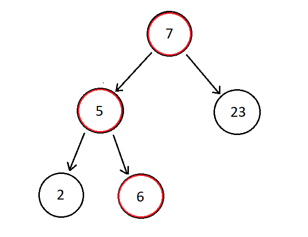
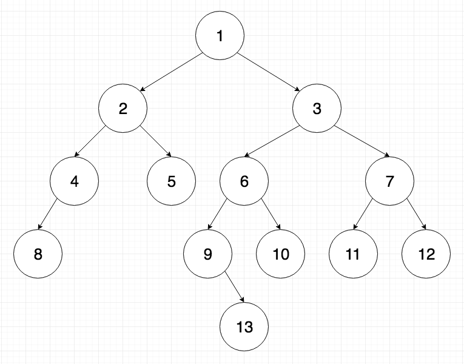

# **Tree**
A tree is a type of linked list that branches out like a tree, hence its name. It has a root node and many other nodes that branch out from it like the picture below.


## Subtrees, Root, Leaf, Parent, and Child Nodes
Every tree has a **root node** which is the node on the top. Nodes on the bottom (or the nodes that are connected to no other nodes) are called **leaf nodes**. Any node that is connected to another node is called a **parent node** and the nodes connected to parent nodes are called **child nodes**. You can also categorize smaller trees within a tree as **subtrees**. The diagram below gives a visual of subtrees as well as root, leaf, parent and child nodes.


## Binary Search Tree

A binary search tree is a type of tree that follows certain rules when putting information and data into a tree. Basically, when data is inserted into a tree, in order to determine it's location it is compared to the root node. If the value of the new data is more than the root node it will be placed to the right, if it is less it will be placed to the left. If there are already multiple child nodes then each is checked and the data will be adjusted down the tree based on it's value.



This visual above shows how the numbers 7, 5, 23, 6, 2 would be organized in a binary search tree. The red circles demonstrate how when 6 is placed in the tree it is less than 7 but more than 5. Therefore it will be placed as a leaf node to the right of the value 5.
### Big O
In a normal linked list we will have 0(n) operation because the entire list will have to be searched. With a binary search tree an entire subtree can be excluded each time the value is compared to the parent node. This will result in O(log n) operation. 

## Tree height
The height of a tree or subtree is determined by counting the root or parent node and then counting the child nodes down a single path.



If we use the picture above and analyze the height starting at the root node one and end at leaf node 13 we will get a height of five. If we start at parent node 2 and end at leaf node 8 we will get a height of three. 

## Balanced and Unbalanced Trees

Determining heights can lead us to knowing if the tree is balanced or unbalanced. An unbalanced tree will have more than one in height difference on any given side than the other. This can be problematic for Big O in binary search trees because we only achieve O(log n) when the tree is balanced. If it is very unbalanced then less of the tree is excluded when searching for a single value. Below shows a balanced and unbalanced tree.


## Recursion

Recursion is something very commonly used in Trees. The basic idea is that you are calling a function within that same function. This means that the function will keep running until you give it a reason to stop (or if you don't, then it runs forever until it crashes). So, be sure to write code that ends the recursion process once you have accomplished your task.

Below is an example of recursion:

```Python
def numbers(x):
    
    if x == 0:
        print(x)
    else:
        numbers(x-1)


numbers(5)
```
If we look at this simple code, we will see that a number is placed into the function and it is checked to see if it is equal to zero. If it is, then the number is printed, if not then we run through the function again but this time we subtract one from x. If we do this we will eventually come to the number zero and it will be printed. As you can see we just called a function within the same function until we got the desired output.

## Creating a BST Example

Now that you have a simple understanding of what a tree is let's look at some code. To create a BST there are some things you will need to know.

Below is an example of inserting values into BST and how it works:

```Python
'''
This is a basic code for inserting values into a binary search tree (BST). Below are two functions that work together to create this tree. The first function "insert" will be the one to insert the value into the node and the second function will be the one to search for an empty node where the value belongs.
'''
def insert(self, value):
	
	if self.root is None:
		self.root = BST.Node(value) 
    #This is done because if the root node is empty then your value will automatically go there.    
	else:
		self.search(value, self.root)
        #This calls the insert_1 function to input a value into its rightful node.  


def search(self, value, node):

	if value < node.value:
		#If the value given is less than the value in the node you are comparing it to then it is placed to the left.
		if node.left is None:
			#Check to see if node is empty
			node.left = BST.Node(value)
            #If it is empty then place the value there.
		else:
			self.search(value, node.left)
            #If it isn't empty then run through the function again using the left node (node.left)

	elif value >= node.value:
		#If the value given is greater than or equal to the value in the node you are comparing it to then it is placed to the right.
		if node.right is None: 
            #Check to see if the node is empty
			node.right = BST.Node(value)
            #If it is empty then place the value there.
		else:			
			self.search(value, node.right)
            #If is isn't empty then run through the function again using the right node (node.right)
```

## Problem


